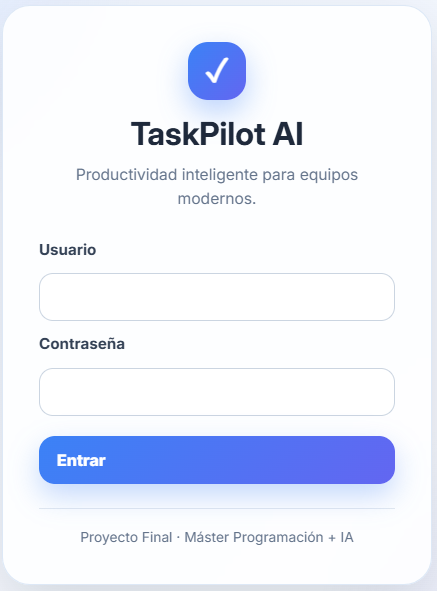
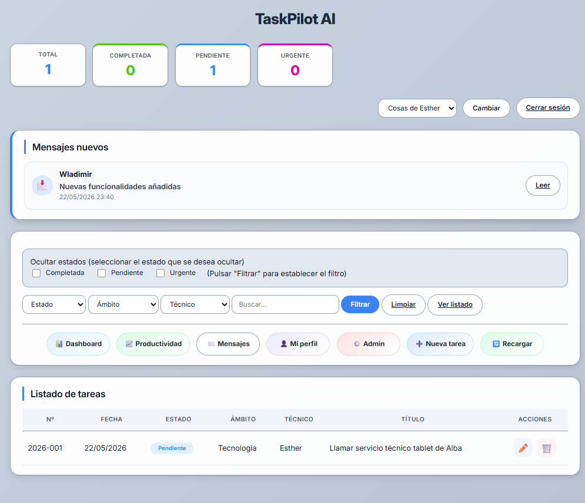
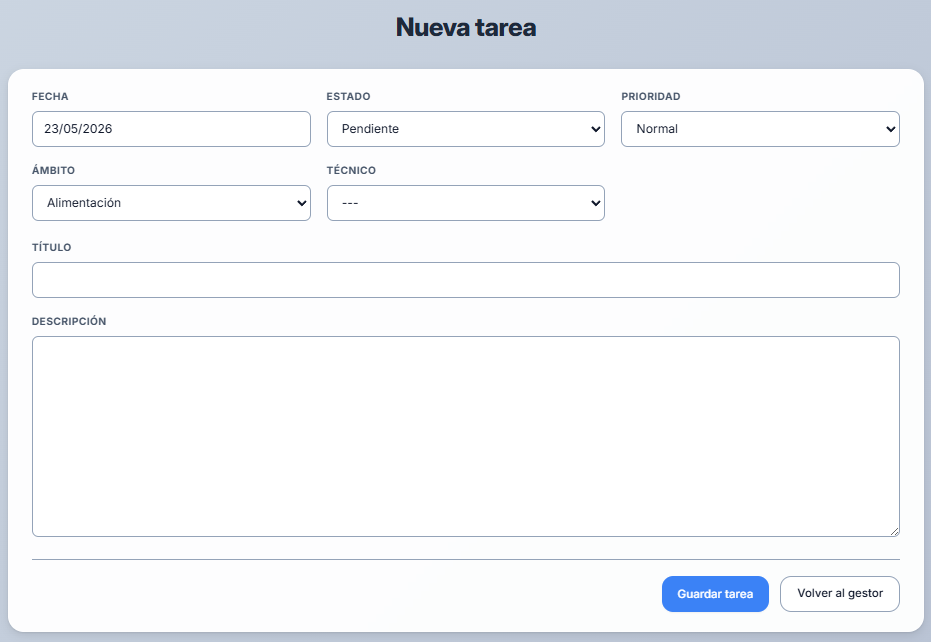
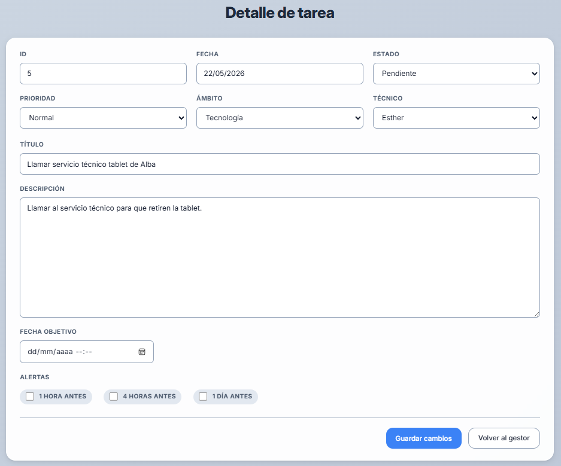
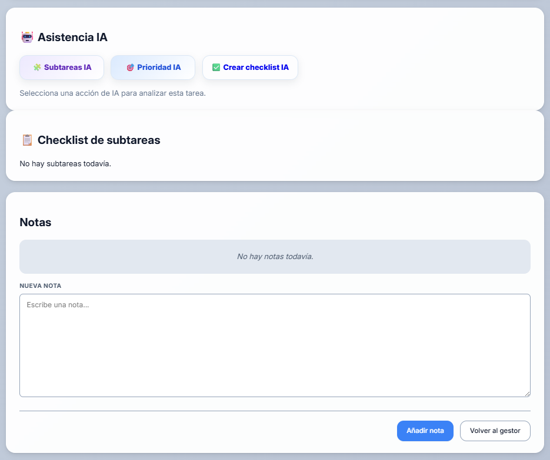
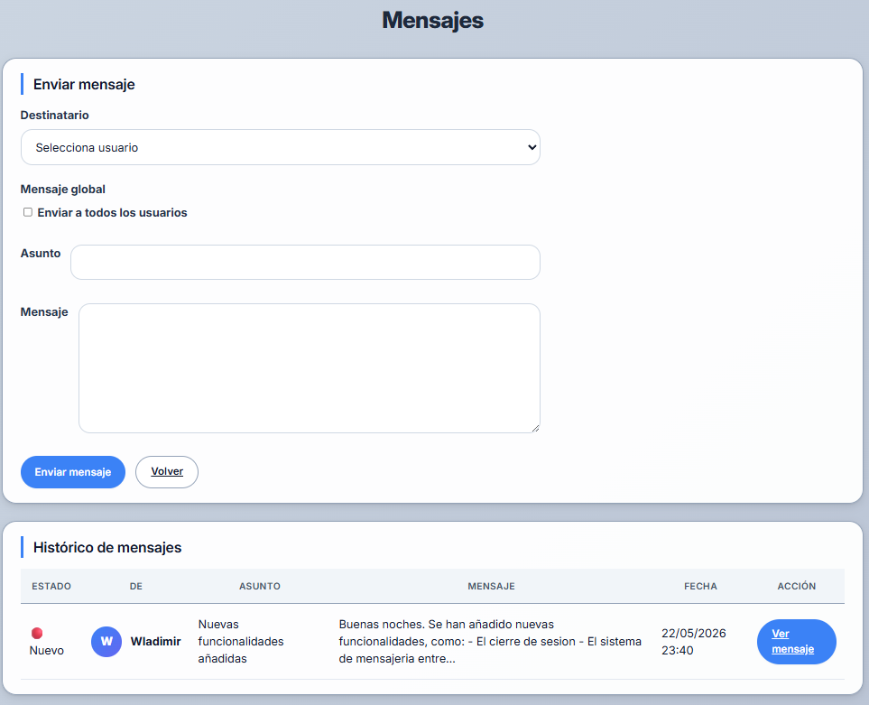
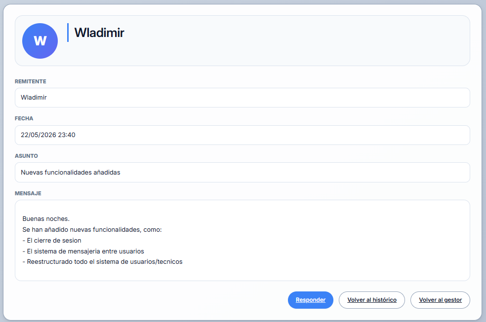
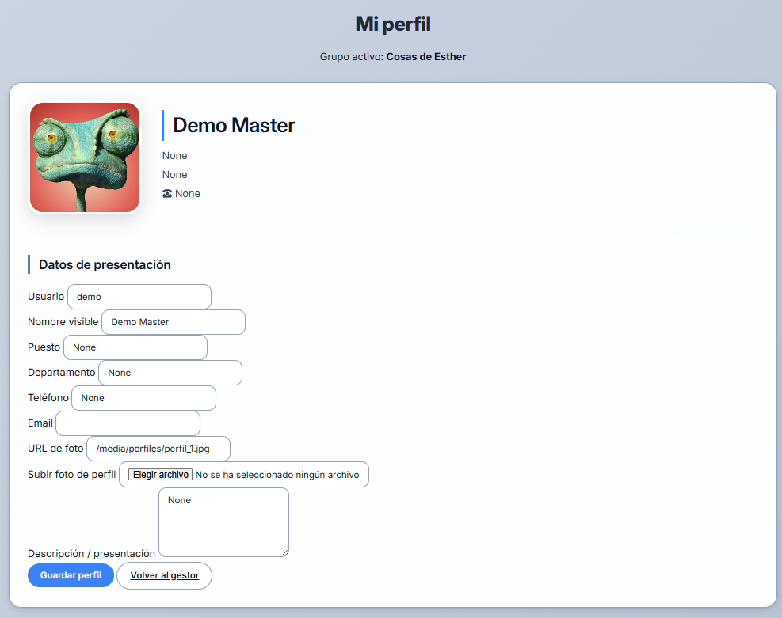

# TaskPilot AI - Gestor Inteligente de Tareas

Aplicación web de gestión de tareas desarrollada con Django y MariaDB como Proyecto Final del Máster de Programación e Inteligencia Artificial.

TaskPilot AI permite gestionar tareas, subtareas, alertas, mensajes internos y equipos de trabajo desde una única plataforma, incorporando además funcionalidades asistidas mediante Inteligencia Artificial.

---

## Objetivo del proyecto

TaskPilot AI nace con el objetivo de facilitar la organización y seguimiento de tareas personales y de equipos de trabajo mediante una plataforma web sencilla, accesible y asistida por Inteligencia Artificial.

La aplicación combina gestión de tareas, alertas, mensajería interna y herramientas de IA para mejorar la productividad y la planificación diaria.

# Demo online

https://taskpilotai.es

usuario: demo
contraseña: demo1234
---

## Repositorio

https://github.com/Ootoito/gestor-tareas-ia-master

# Características principales

## Gestión de tareas

- Creación y edición de tareas.
- Estados personalizables.
- Prioridades y seguimiento.
- Fechas objetivo.
- Histórico de cambios.

## Subtareas y checklist

- Creación manual de subtareas.
- Listas de comprobación.
- Seguimiento visual del progreso.

## Alertas

- Alertas configurables por tarea.
- Avisos automáticos antes de una fecha objetivo.
- Sistema dinámico basado en base de datos.
- Los tipos de alerta pueden añadirse o modificarse sin cambios en el código fuente.

Ejemplos:

- 10 minutos antes
- 30 minutos antes
- 1 hora antes
- 1 día antes
- 7 días antes
- 14 días antes

Los tiempos disponibles son gestionados desde la base de datos y se muestran automáticamente en la aplicación.

## Sistema de mensajes

- Mensajería interna entre usuarios.
- Histórico de mensajes enviados y recibidos.
- Lectura detallada de mensajes.
- Sistema de notificaciones.

## Gestión de usuarios y grupos

- Usuarios.
- Técnicos.
- Grupos de trabajo.
- Administradores del sistema.

## Perfil de usuario

- Fotografía personal.
- Datos de contacto.
- Información profesional.

---

# Inteligencia Artificial

TaskPilot AI incorpora funcionalidades basadas en Inteligencia Artificial mediante llamadas a modelos de lenguaje.

Actualmente permite:

- Generación automática de subtareas.
- Creación automática de checklists.
- Asistencia en la organización de tareas.
- Ayuda en la planificación del trabajo.

Estas funcionalidades permiten reducir el tiempo de planificación y mejorar la productividad del usuario.

---

## Funcionalidades implementadas

- Gestión de tareas
- Gestión de subtareas
- Sistema de alertas
- Sistema de mensajería interna
- Gestión de perfiles
- Gestión de grupos
- Administración de usuarios
- Dashboard de seguimiento
- Integración con Inteligencia Artificial

Las respuestas son generadas dinámicamente mediante modelos de lenguaje y se integran directamente en la aplicación.

### Sistema de configuración dinámica

TaskPilot AI incorpora elementos configurables desde base de datos, permitiendo modificar comportamientos de la aplicación sin necesidad de realizar cambios en el código fuente.

Un ejemplo es el sistema de alertas, cuyos intervalos temporales son gestionados dinámicamente desde la base de datos.

## Cumplimiento de requisitos

- Aplicación web responsive desarrollada con HTML5, CSS3 y JavaScript.
- Interfaz adaptada para dispositivos móviles y escritorio.
- Backend desarrollado con Django.
- Persistencia de datos mediante MariaDB.
- Integración de Inteligencia Artificial.
- Aplicación desplegada online.
- Código fuente publicado en GitHub.

# Tecnologías utilizadas

## Backend

- Python 3
- Django
- MariaDB

## Frontend

- HTML5
- CSS3
- JavaScript

## Infraestructura

- Ubuntu Server
- Gunicorn
- Nginx
- Git
- GitHub

---

# Arquitectura

```text
Usuario
   │
   ▼
Frontend (HTML/CSS/JS)
   │
   ▼
Django
   │
   ├── Gestión de tareas
   ├── Mensajería
   ├── Alertas
   ├── IA
   └── Administración
   │
   ▼
MariaDB
```

---

# Instalación local

## Clonar repositorio

```bash
git clone https://github.com/Ootoito/gestor-tareas-ia-master.git
```

## Crear entorno virtual

```bash
python -m venv .venv
```

## Activar entorno virtual

Windows:

```bash
.venv\Scripts\activate
```

Linux:

```bash
source .venv/bin/activate
```

## Instalar dependencias

```bash
pip install -r requirements.txt
```

## Configurar variables de entorno

Crear archivo `.env` usando como referencia `.env.example`.

## Ejecutar migraciones

```bash
python manage.py migrate
```

## Lanzar servidor

```bash
python manage.py runserver
```

---

# Capturas de pantalla

## Inicio de sesión



## Panel principal



## Pantalla tareas



## Detalle de tarea



## Subtareas AI



## Sistema de mensajes



## Mensaje recibido



## Perfil de usuario



---

# Estado del proyecto

Versión funcional desplegada y operativa.

Actualmente se encuentra en fase de mejora continua y ampliación de funcionalidades.

---

# Autor

Wladimir Cova

Proyecto académico desarrollado como Trabajo Final de Máster.